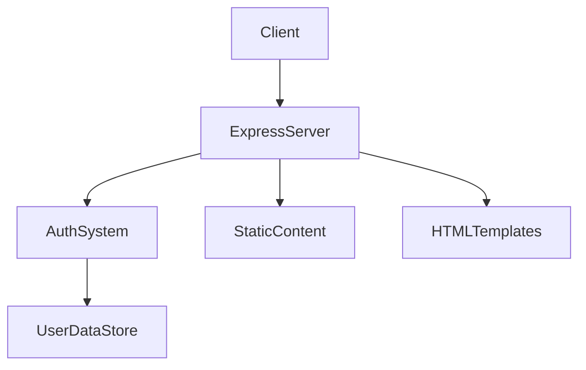
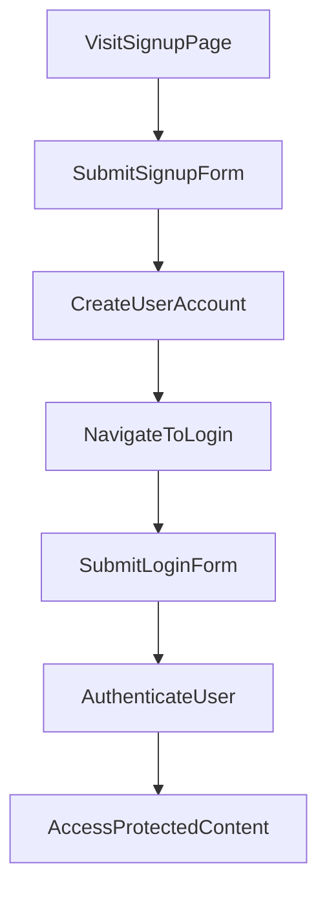

```markdown
# 1. Overview

This project appears to be a web application built primarily with Node.js and Express, focused on user authentication and serving dynamic and static content. It enables users to sign up, log in, and access protected resources, possibly including personalized content like user photos. The presence of `templates` and `static` folders suggests a traditional server-rendered application with client-side assets for enhanced interactivity. The file names like `farmer.html`, `pilot.html`, `flipbook.css`, and various images/audio files indicate a themed user experience, potentially involving storytelling, role-based dashboards, or interactive visual elements. User data is managed through a MongoDB database, implied by the `models/User.js` file and `mongoose` dependency.

# 2. Architecture Diagram (Mermaid)



# 3. Project Workflow (Mermaid + Explanation)

This workflow describes how a new user registers, logs in, and accesses authenticated content.



**Workflow Steps:**

1.  **Visit Signup Page**: A new user navigates to the application's signup page, likely by accessing a specific URL that serves the `signup.html` template.
2.  **Submit Signup Form**: The user fills out the registration form with their details (e.g., username, password) and submits it, sending a `POST /signup` request to the server.
3.  **Create User Account**: The Express server, via the authentication routes (`auth.js`), processes the signup request, validates the data, and creates a new user record in the `UserDataStore` (MongoDB, using the `User.js` model).
4.  **Navigate to Login**: After successful account creation, the user is typically redirected to the login page (`login.html`) to sign in with their new credentials.
5.  **Submit Login Form**: The user enters their registered credentials and submits the login form, sending a `POST /login` request to the server.
6.  **Authenticate User**: The Express server verifies the user's credentials against the `UserDataStore`. Upon successful authentication, it likely generates and sends a JSON Web Token (JWT) or sets up a session for the user.
7.  **Access Protected Content**: With a valid authentication token or session, the user can then access protected resources, such as their dashboard (`dashboard.html`) or specific files like `/user/:uid/photos/:file`, demonstrating authenticated access to content.

# 4. API Endpoints

The following API endpoints are identified in this project:

*   **`POST /signup` (from `routes/auth.js`)**:
    This endpoint is used for user registration. It expects user credentials (e.g., username, password) to create a new user account in the system.
*   **`POST /login` (from `routes/auth.js`)**:
    This endpoint handles user authentication. Users submit their credentials, and if valid, the server responds with a token or session information, granting access to protected routes.
*   **`GET /me` (from `routes/auth.js`)**:
    This endpoint is likely used to retrieve the profile or details of the currently authenticated user. It typically requires an authentication token to identify the user making the request.
*   **`GET /user/:uid/photos/:file` (from `node_modules/express/lib/response.js`, but likely defined in a custom route for serving user-specific content)**:
    This endpoint is designed to serve specific photo files for a given user. `:uid` would be the user's unique identifier, and `:file` would be the name of the photo file. This suggests a user-specific content or gallery feature.

# 5. Recent Commit History (Last 5)

*   **`30938d8 docs: auto-generate README using AutoDocs`**: This commit indicates the recent addition of automated documentation generation to the project.
*   **`7bd9cfc Create README.md`**: This commit shows that a `README.md` file was initially created, likely as a placeholder or basic project description.
*   **`b431ee2 uploaded my project`**: This initial commit marks the first upload of the project, suggesting the point at which the core structure and initial functionality were made available.

# 6. File Structure

```
📁 .git
  📄 config
  📄 description
  📄 HEAD
  📁 hooks
  📄 index
  📁 info
  📁 logs
  📁 objects
  📄 packed-refs
  📁 refs
📄 .gitignore
📄 app.py
📁 models
  📄 User.js
📁 node_modules
📄 package-lock.json
📄 package.json
📄 README.md
📁 routes
  📄 auth.js
📄 server.js
📁 static
  📁 audio
  📁 css
  📄 dashboard.js
  📁 gif
  📁 images
  📁 js
  📄 style.css
📁 templates
  📄 dashboard.html
  📄 farmer.html
  📄 index.html
  📄 login.html
  📄 pilot.html
  📄 script.js
  📄 signup.html
  📄 sunny.html
```

**Major Folders and Files:**

*   **`server.js`**: This is the main entry point for the Node.js Express application. It likely initializes the server, configures middleware, and mounts the application routes.
*   **`routes/`**: This directory contains route definitions for different parts of the application.
    *   **`auth.js`**: Handles authentication-related routes such as user signup, login, and potentially fetching user details (`/me`).
*   **`models/`**: This directory defines the data schemas and models for interacting with the database.
    *   **`User.js`**: Defines the Mongoose schema for the `User` entity, outlining the structure and validation rules for user data stored in MongoDB.
*   **`static/`**: This folder holds static assets served directly to the client's browser.
    *   **`audio/`**: Contains audio files (e.g., `sneeze.mp3`, `tractor.mp3`).
    *   **`css/`**: Stores CSS stylesheets (e.g., `flipbook.css`, `style.css`) for styling the web pages.
    *   **`gif/`**: Contains animated GIF images (e.g., `farm.gif`).
    *   **`images/`**: Stores static image files (e.g., `sun.jpg`, `tractor.jpg`).
    *   **`js/`**: Contains client-side JavaScript files (e.g., `flipbook.js`).
*   **`templates/`**: This directory contains HTML template files that are rendered by the server and sent to the client. These files define the user interface for various pages.
    *   Examples include `signup.html`, `login.html`, `dashboard.html`, and potentially themed pages like `farmer.html`, `pilot.html`, `sunny.html`, `flipbook.html`.
*   **`package.json`**: This file defines the project's metadata and lists its dependencies (e.g., Express, Mongoose, jsonwebtoken, bcryptjs), indicating a Node.js project.
*   **`node_modules/`**: Contains all the third-party libraries and modules installed for the project, managed by npm.
*   **`app.py`**: While `node_modules` and `server.js` point to a Node.js project, this `app.py` could indicate a legacy Python component, a separate microservice, or an artifact from a different project setup. Given the other files, it does not appear to be the primary entry point for the current web application.

# 7. AutoDocs Note

This documentation was automatically generated by AutoDocs.
```