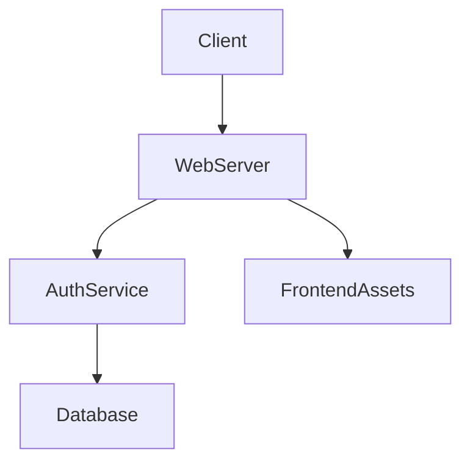
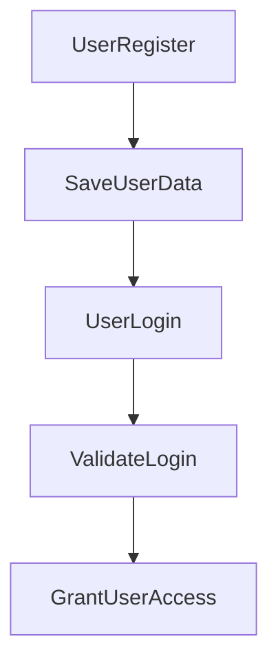

---

# 1. Overview

This project appears to be a foundational web application focusing on user authentication and management. It provides functionality for users to sign up, log in, and access personalized content. The presence of Node.js-related files (`server.js`, `routes/auth.js`, `models/User.js`, `node_modules/express`, `node_modules/mongoose`, `node_modules/mongodb`) strongly indicates a backend built with Express.js and MongoDB for data storage. The `static` and `templates` folders suggest a traditional server-rendered web interface, serving HTML, CSS, JavaScript, and various media assets directly. The inclusion of `app.py` is an anomaly, but the core functionality points to a Node.js-driven system.

---

# 2. Architecture Diagram (Mermaid)



-   **Client**: Represents the user's web browser interacting with the application.
-   **WebServer**: The main server component (`server.js`) handling HTTP requests using Express.js. It routes requests, serves static files, and renders templates.
-   **AuthService**: Handles user authentication and authorization logic, interacting with user data via the `routes/auth.js` and `models/User.js`.
-   **Database**: Stores application data, specifically user information, managed by MongoDB (inferred from `mongoose` and `mongodb` dependencies).
-   **FrontendAssets**: Static files (CSS, JS, images, audio) and HTML templates served directly by the WebServer to the Client.

---

# 3. Project Workflow (Mermaid + Explanation)

This workflow describes a typical user authentication process, from registration to accessing a secured profile.



1.  **UserRegister**: A user accesses the `/signup` page and submits their registration details (e.g., username, password).
2.  **SaveUserData**: The `WebServer` receives the registration data, `AuthService` processes it (e.g., hashes password), and stores the new user's information in the `Database`.
3.  **UserLogin**: The newly registered user (or an existing one) accesses the `/login` page and submits their credentials.
4.  **ValidateLogin**: The `WebServer` sends login credentials to the `AuthService`, which queries the `Database` to verify the user's identity and password.
5.  **GrantUserAccess**: Upon successful validation, the `AuthService` issues an authentication token (e.g., JWT) to the `WebServer`, which then grants the user access to secured endpoints like `/me` or serves the `dashboard.html` template.

---

# 4. API Endpoints

This project provides the following key API endpoints:

*   **`POST /signup`** (from `routes/auth.js`):
    *   Allows new users to register an account with the system by submitting their credentials.
*   **`POST /login`** (from `routes/auth.js`):
    *   Enables existing users to authenticate and gain access to protected resources by providing their login credentials.
*   **`GET /me`** (from `routes/auth.js`):
    *   Retrieves the profile information of the currently authenticated user. This endpoint typically requires an authentication token.
*   **`GET /user/:uid/photos/:file`** (inferred from `express/lib/response.js` context, likely a custom route):
    *   Allows retrieval of a specific photo (`:file`) belonging to a particular user (`:uid`). This suggests functionality for users to store and access their personal media.

---

# 5. Recent Commit History (Last 5)

The recent commit history indicates the very early stages of this project:

*   **`7bd9cfc Create README.md`**: This commit added the initial documentation file, which is a standard practice after setting up a project.
*   **`b431ee2 uploaded my project`**: This is the very first commit, signifying the initial push of the entire project codebase to the repository.

These commits collectively suggest that the project is newly initiated, with the core structure and initial setup having just been completed and documented.

---

# 6. File Structure

```
📁 .git                      # Git version control metadata
📄 .gitignore                # Specifies intentionally untracked files to ignore
📄 app.py                    # A Python application file; its role is unclear in a primarily Node.js project.
📁 models                    # Contains Mongoose models for defining database schemas.
  📄 User.js                 # Defines the schema and model for user data (e.g., username, password).
📁 node_modules              # Directory for installed Node.js packages and their dependencies.
📄 package-lock.json         # Records the exact dependency tree for Node.js packages.
📄 package.json              # Defines project metadata and lists Node.js dependencies.
📄 README.md                 # Project README file.
📁 routes                    # Contains route definitions for the Express.js application.
  📄 auth.js                 # Handles authentication-related routes like signup, login, and user profile.
📄 server.js                 # The main entry point for the Node.js Express server.
📁 static                    # Stores static assets (CSS, JS, images, audio) directly served by the web server.
  📁 audio                   # Contains audio files (sneeze.mp3, tractor.mp3, wiggle.mp3).
  📁 css                     # Contains CSS stylesheets (flipbook.css, style.css).
  📄 dashboard.js            # JavaScript file, likely for dashboard functionality.
  📁 gif                     # Contains GIF images (farm.gif).
  📁 images                  # Contains image files (sun.jpg, tractor.jpg).
  📁 js                      # Contains JavaScript files (flipbook.js).
📁 templates                 # Contains HTML template files for server-side rendering.
  📄 dashboard.html          # HTML template for the user dashboard.
  📄 farmer.html             # Specific HTML template, possibly for a user role or feature.
  📄 index.html              # The main entry HTML page.
  📄 login.html              # HTML template for the user login page.
  📄 pilot.html              # Specific HTML template, possibly for a user role or feature.
  📄 script.js               # General JavaScript for templates.
  📄 signup.html             # HTML template for the user registration page.
  📄 sunny.html              # Specific HTML template, possibly for a feature or aesthetic.
```

---

# 7. AutoDocs Note

This documentation was automatically generated by AutoDocs.